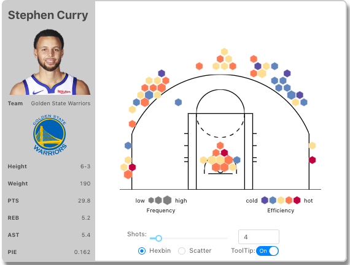

# NSA

Me playing with around React.js and front end; I designed a dashboard using React, D3 and Ant Design backed by API from stats.nba.com to visualize any individual player’s shot data, including a shot chart and user profile view. Just like this:



The implementation invovles creating a few extra filters and 2 shot themes(hexbin and scatter) to provide the more customized visualization you see on the shotchart. The autocomplete player search bar added below providing a list of players(image and name) in the suggestion list.

## Getting Started

These instructions will get you a copy of the project up and running on your local machine for development and testing purposes. 

### Prerequisites

Just get [npm and Node.js](https://www.npmjs.com/get-npm), then

```
git clone https://github.com/ZhekaiJin/NSA.git
npm install
```
wait with your patience for all packages to be installed 

### Installing
In the project directory, you can run:

#### `npm start`

Runs the app in the development mode.<br>
Open [http://localhost:3000](http://localhost:3000) to view it in the browser.

The page will reload if you make edits.<br>
You will also see any lint errors in the console.

### Testing

#### `npm test`

Launches the test runner in the interactive watch mode.<br>
See the section about [running tests](https://facebook.github.io/create-react-app/docs/running-tests) for more information.

### Build

#### `npm run build`

Builds the app for production to the `build` folder.<br>
It correctly bundles React in production mode and optimizes the build for the best performance.

The build is minified and the filenames include the hashes.<br>
Your app is ready to be deployed!

See the section about [deployment](https://facebook.github.io/create-react-app/docs/deployment) for more information.

## Deployment


## Built With

* [npm]() - The package manager for JavaScript 
* [Node.js](https://maven.apache.org/) - a JavaScript runtime built on Chrome's V8 JavaScript engine.
* [nba](https://www.npmjs.com/package/nba) - The NBA's stats API for the browser or Node
* [d3.js](https://d3js.org/) - [d3-shotchart](https://www.npmjs.com/package/d3-shotchart) for basketball court visualization
* [antd](https://www.npmjs.com/package/antd) - An enterprise-class UI design language and React implementation.

## Authors

* **Zhekai Jin** 

## License

This project is licensed under the MIT License - see the [LICENSE.md](LICENSE.md) file for details

## Acknowledgments

* This project was bootstrapped with [Create React App](https://github.com/facebook/create-react-app).


